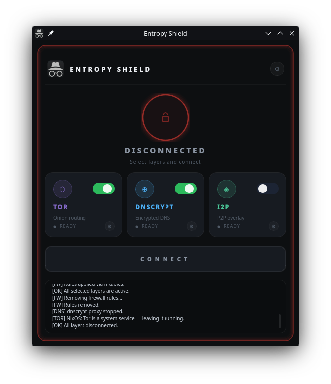
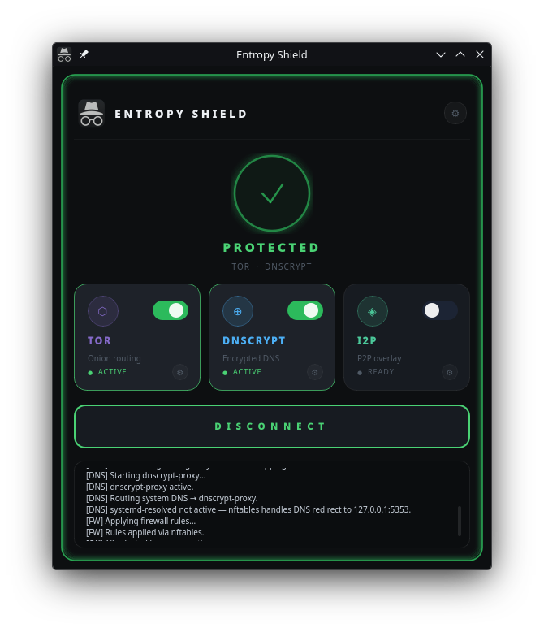

<p align="center">
  
</p>

<h1 align="center">Escudo Anónimo</h1>

<p align="center">
  Aplicación de escritorio para Linux que rutea tu tráfico de red a través de Tor, DNSCrypt e I2P.<br>
  Desarrollado con Python y PyQt6.
</p>

<p align="center">
  <a href="https://agdalasv.github.io/escudo-anonimo/">
    
  </a>
</p>

---

Una interfaz gráfica para controlar cada capa de privacidad, monitorear actividad en tiempo real y configurar los servicios sin tocar archivos de configuración manualmente.

---

## Características

- **🧅 Tor**: Ruta todo el tráfico TCP a través de la red Tor mediante proxy transparente. Tu IP real permanece oculta.
- **🔐 DNSCrypt**: Encripta y autentica todas las consultas DNS para que tu ISP no pueda ver qué dominios resuelves.
- **🌐 I2P**: Conecta a la red anónima I2P via i2pd. Útil para acceder a servicios internos (.i2p).
- **🚫 Block**: Bloquea sitios web no deseados con protección por contraseña.

---

## Capturas de pantalla

| Desconectado | Conectado |
|-------------|----------|
|  |  |

---

## Requisitos

### Todas las distribuciones
- Python 3.10 o superior
- PyQt6
- Tor
- dnscrypt-proxy
- i2pd
- nftables o iptables
- Polkit (pkexec)

### NixOS only
- Se recomienda una entrada existente `services.tor.enable = true` en tu `configuration.nix`.

---

## Instalación

### Descargar

[Descarga el código aquí](https://agdalasv.github.io/escudo-anonimo/)

O clona el repositorio:
```bash
git clone https://github.com/agdalasv/escudo-anonimo.git
cd escudo-anonimo
```

### Debian / Ubuntu
```bash
sudo bash installers/install-debian.sh
```

### Fedora
```bash
sudo bash installers/install-fedora.sh
```

### Arch Linux
```bash
sudo bash installers/install-arch.sh
```

### NixOS
```bash
sudo bash installers/install-nixos.sh
```

---

## Cómo usar

1. Abre la aplicación.
2. Selecciona las capas de privacidad que quieres usar (Tor, DNSCrypt, I2P, Block).
3. Presiona **Conectar**. El anillo de estado se vuelve verde cuando está activo.
4. Presiona **Desconectar** para detener todo.

---

## Configuración

Haz clic en el botón de engranaje para abrir el panel de ajustes:
- **Tor**: Puertos, nodos de salida, StrictNodes
- **DNSCrypt**: Puerto, DNSSEC, no-log, no-filter
- **I2P**: Puertos HTTP/SOCKS, ancho de banda
- **Block**: Sitios a bloquear, contraseña

Los ajustes se guardan en `~/.config/escudo-anonimo/config.json`.

---

## Estructura del proyecto

```
escudo-anonimo/
  main.py                  Punto de entrada.
  logos/                   Iconos de la app.
  core/
    config.py              Configuración JSON.
    connection.py          Orquestador de capas.
    firewall.py           Reglas nftables/iptables.
    tor.py                Servicio Tor.
    dnscrypt.py            Servicio DNSCrypt.
    i2p.py                 Servicio I2P.
    blocker.py             Bloqueador de sitios.
    platform.py            Detección de SO.
  gui/
    main_window.py         Ventana principal.
    widgets.py             Componentes personalizados.
    themes.py             Temas oscuro/claro.
    settings_panel.py     Panel de ajustes.
  installers/             Scripts de instalación.
  index.html              Página de descarga.
```

---

## Apoyar el proyecto

Invita una taza de café ☕

**BTC:** `3L8f3v6BWwL7KBcb8AMZQ2bpE3ACne2EUf`

---

## Reportar bugs

¿Encontraste un bug? Escríbenos: **agdala.sv@gmail.com**

---

## Licence

MIT License - 2026 Agdala